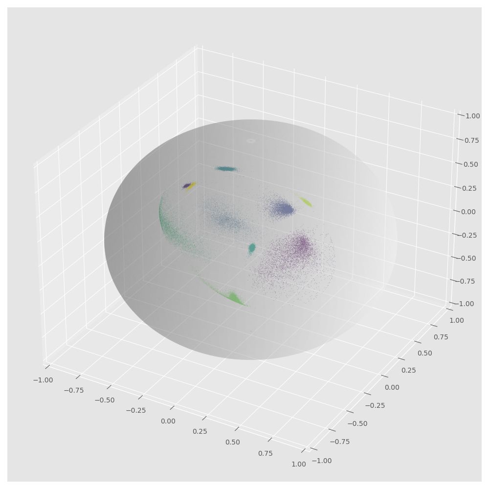

# AM-SoftMax-FashionMnist

This is the practice for the implementation of AM-SoftMax. It is done with Fahsion MNIST dataset.

## Prerequisites
- Pytorch 2.0.1
- Python 3.11.4
- Window 11
- conda 23.7.4

## Training
```
# GPU training
python train.py
```

## Result (Plot)

<div align="center">
    <a href="./">
        
    </a>
</div>

